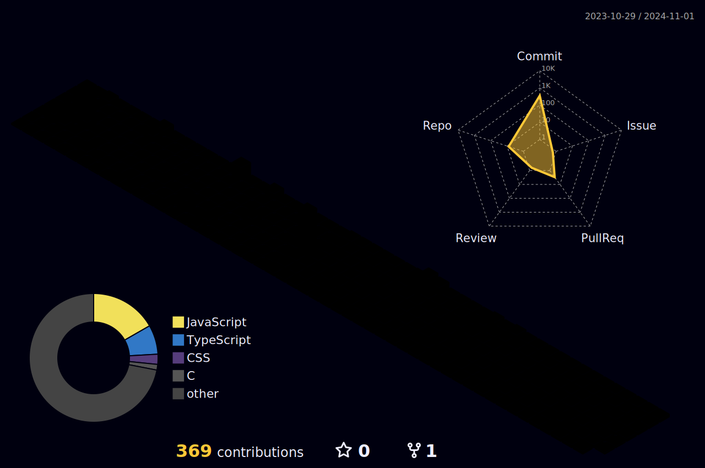

<!DOCTYPE html>
<html lang="en">
<head>
  <meta charset="UTF-8">
  <meta name="viewport" content="width=device-width, initial-scale=1.0">
</head>
<body>
  

    <h1>😸 Hi 😸</h1>

  

    
    
    
    
  

    
My Blocks?

  

  </body>
</html>

